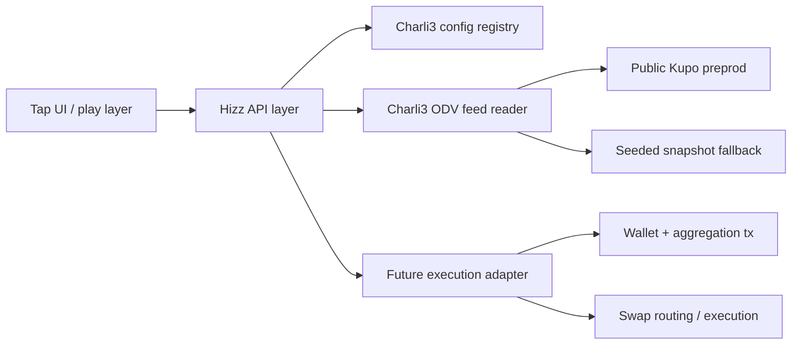

# Hizz Swap

Hizz Swap is an **oracle-first prototype** for a gameified Cardano swap experience. The product direction is simple:

- make swapping feel fast, playful, and streak-based,
- keep price truth anchored to **Charli3 Pull Oracle / ODV**,
- leave room for a future execution layer that can graduate from demo loops into real swap flows.

This repo starts with the read path, not the full transaction path. That is deliberate. We want the UX and oracle architecture to be correct before we wire wallet signing and on-chain execution.

## What is already in this repo

- A lightweight zero-dependency Node server
- A branded static prototype UI
- A small JSON config registry derived from the official Charli3 hackathon feed configs
- An oracle adapter that:
  - loads official preprod feed settings,
  - tries to read the latest feed data from the public synced preprod Kupo instance,
  - falls back to a seeded snapshot path when the live endpoint is unavailable
- Initial project docs and milestone planning

## Why Charli3 is at the center

This prototype is explicitly built around **Charli3 ODV** rather than around a generic price API.

- Charli3 Pull Oracle gives us a request-driven oracle model that matches low-latency dApp use cases.
- The official preprod configs already include:
  - oracle address,
  - policy id,
  - reference script UTxO,
  - oracle node endpoints,
  - validity window
- The hackathon stack also exposes a public synced Ogmios and Kupo pair, which makes it possible to prototype the read path without deploying our own infrastructure first.

## Prototype architecture



### Current layers

1. **Play layer**
   The browser UI stages swap size, risk mode, streak goals, and slippage presets.

2. **Oracle adapter**
   The Node backend loads official Charli3 market configs and attempts to hydrate feed state from Kupo.

3. **Fallback path**
   If the public preprod endpoint is unreachable from the current environment, the backend still returns a truthful readiness state instead of pretending it is live.

### Next layer

4. **Execution adapter**
   This is where wallet connection, ODV aggregation, and swap construction will land next.

## Repo layout

```text
hizz-swap/
├─ oracle-configs/
│  ├─ ada-usd-preprod.json
│  ├─ btc-usd-preprod.json
│  └─ usdm-ada-preprod.json
├─ public/
│  ├─ app.js
│  ├─ index.html
│  └─ styles.css
├─ src/
│  └─ charli3/
│     ├─ config-store.mjs
│     ├─ oracle-service.mjs
│     └─ oracle-snapshots.mjs
├─ milestone.md
├─ package.json
└─ server.mjs
```

## Configured oracle markets

The repo currently ships these official preprod feeds:

- `ADA/USD`
- `BTC/USD`
- `USDM/ADA`

The original source for those definitions is the Charli3 hackathon resources repo. The JSON copies in this repo are normalized from the YAML files and rewritten to use the public synced preprod endpoints shared in the hackathon brief.

## How the current oracle read works

For a selected market:

1. Load the market config from `oracle-configs/`
2. Read the configured oracle contract address
3. Query the public Kupo instance at:
   - `http://35.209.192.203:1442`
4. Attempt to parse the first Charli3-style datum map containing:
   - price,
   - created time,
   - expiry time,
   - optional precision and symbols
5. Return one of three readiness states:
   - `live`
   - `seeded`
   - `config-only`

That readiness model is important. It prevents the UI from silently fabricating a "live" oracle if the environment cannot reach the public index.

## Running the prototype

### Requirements

- Node `24+`

### Install

No package installation is required for the current prototype.

### Start

```bash
npm run dev
```

Then open:

```text
http://127.0.0.1:3000
```

### Optional syntax check

```bash
npm run check
```

## Available API endpoints

### `GET /api/health`

Simple process heartbeat.

### `GET /api/oracles`

Returns the configured market rail:

- display name
- node count
- validity window
- shortened policy and address ids

### `GET /api/oracles/:id`

Returns:

- the full normalized Charli3 config for that market
- runtime node info
- oracle readiness
- parsed feed details when available
- fallback notes when live hydration fails

## Product direction after this foundation

### Near term

- Improve ODV datum parsing for live preprod reads
- Surface richer oracle telemetry in the UI
- Move from staged tap sessions into transaction previews

### Next major build

- Add wallet integration
- Hook into the Charli3 ODV aggregation workflow
- Begin wiring the actual swap execution adapter

### Longer term

- Full tap-to-swap session loop
- Streaks, points, and shareable recap cards
- Live oracle-backed execution on Cardano

## Source map

Primary resources used for this foundation:

- [Charli3 hackathon resources](https://github.com/Charli3-Official/hackathon-resources)
- [Pull Oracle docs](https://docs.charli3.io/oracles/products/pull-oracle/summary)
- [Pull Oracle client](https://github.com/Charli3-Official/charli3-pull-oracle-client)
- [Datum demo reader](https://github.com/Charli3-Official/datum-demo-v3/tree/main)
- Public preprod sync endpoints from the hackathon brief:
  - `Ogmios: http://35.209.192.203:1337/`
  - `Kupo: http://35.209.192.203:1442/`

## Notes

- The current prototype is intentionally **read-first**.
- It already respects the "must use Charli3 oracle" constraint at the architecture level.
- Real swap execution is the next layer, not something hidden behind fake buttons today.

